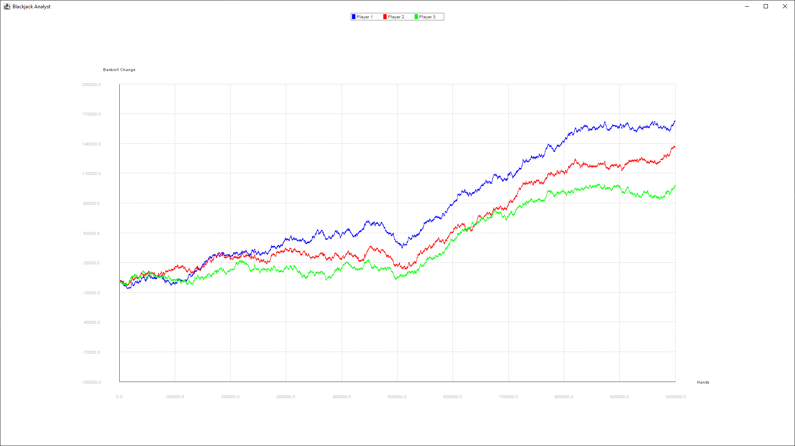
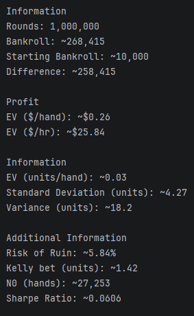
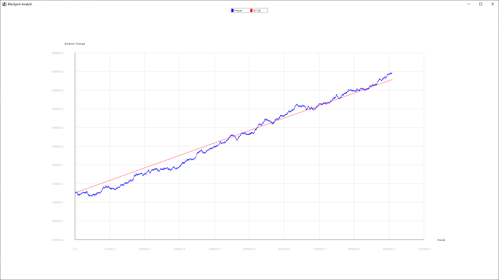

# Blackjack Analyst
A highly-extensible and effective blackjack simulator app written in Java. It allows you to simulate millions of hands very quickly with adjustable betting, strategies, and side bets; and review statistics from the simulations. Since it is in Java, it is incredibly easy to add new side bets, new versions of blackjack, or really just modify anything about the analyst.

## Running
Currently, the code can be run by modifying the main file. The app acts more as a library.

## Features
All the code is made to be modified. You can extend whatever classes you want. You can completely rework the game. That being said, there are already a lot of features that I implemented.

#### Rules
The rules are extremely easy to use and there are more than 10 rules to select from. They can be created through the `Rules.Builder()` class or set manually. The `Rules()` class can be found <b>[here](./src/main/java/me/lel/core/Rules.java)</b>.

#### Card Counting
When creating an instance of `Blackjack()` an instance of interface `CountSystem()` can be provided. I already made 2 counting systems: `NoCountSystem()` and `HiLoCountSystem()`
If you would like a different system, all you need to do is implement `CountSystem()`

#### Blackjack
`Blackjack()` is the actual game. It can easily be extended to modify it to create games like `FreeBetBlackjack()` or double down blackjack. It supports early surrender, late surrender, and insurance already.

#### Player
`Blackjack()` can accept multiple players. Each player has a `Better()`, `Mover()`, `SideBetMover()` as well as a bankroll.

#### Better, Mover, and Side Bet Mover

The `Better()` can be coded, but there is also a loader can use a csv file that is correctly formatted.
A sample better is provided through <b>[samplebet.csv](./src/main/resources/samplebet.csv)</b>.

This is the same for the mover and the side bet mover. I have samples of all of these, and more can be added by implementing their respective interfaces or through the loader and csv files.

#### Simulation
I created a `Simulation()` class that can help run simulations of the `Game()` interface. `Blackjack()` can be played by itself, but `Simulation()` makes it easier to run many interactions and track statistics.

You can view statistics of different players and graph their ev too.

## Contribute
<b>Contributions are definitely welcome</b>. I'm not sure how much I will be adding to this project, and it has not been tested extensively (I have confirmed it working by putting it up against other simulators, but this is extremely limited). Any bugs are welcome to be reported or fixed. If you add any new games or add counting systems, I would love to include them in this project.