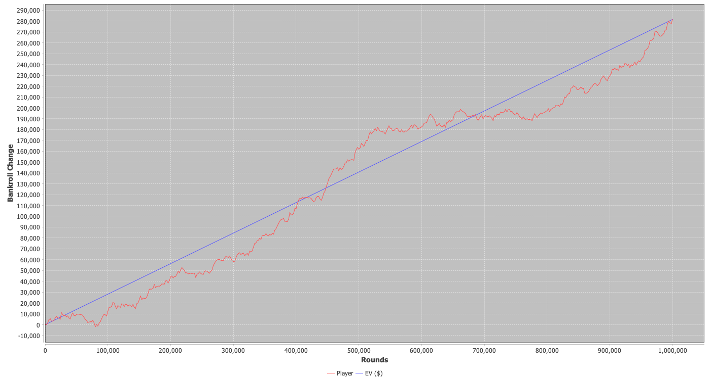
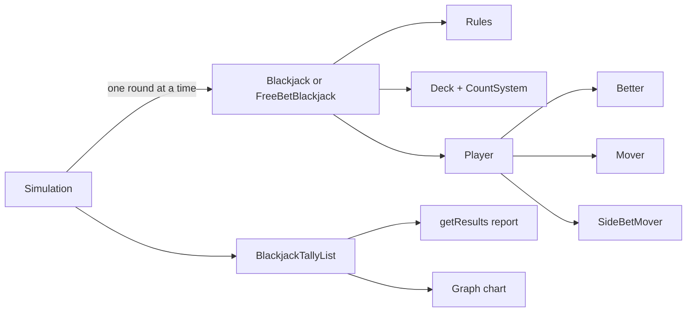
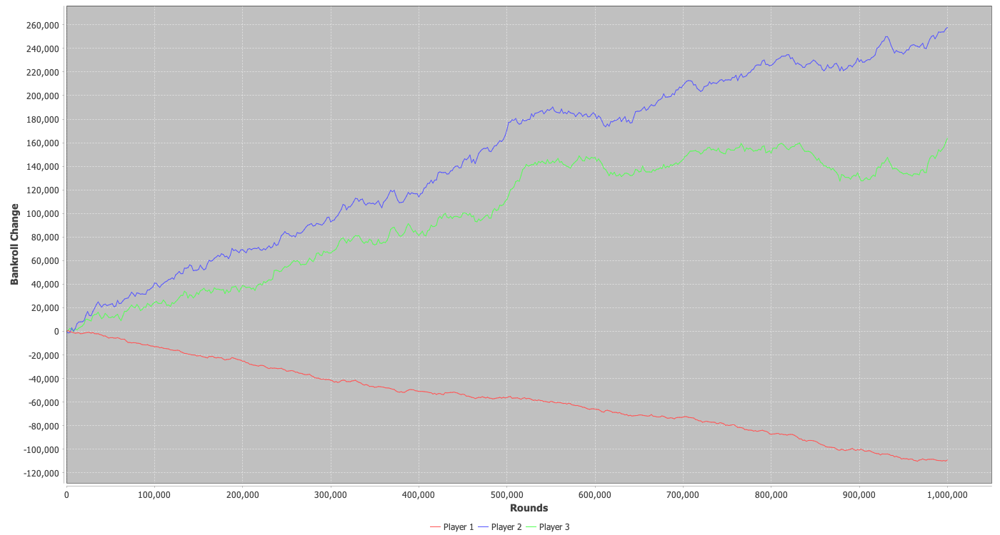

<a id="top"></a>

<div align="center">

# Blackjack Analyst

A blackjack simulator you use as a Java library. Set up a table, seat some players with their strategies, run millions of rounds and find out what each strategy is worth.


[Quick start](#quick-start) • [Features](#features) • [Guide](#guide) • [FAQ](#faq) • [Contributing](#contributing)



<sub>A Hi-Lo counter's bankroll over a million rounds, next to its EV line.</sub>

</div>

Blackjack Analyst deals blackjack to itself, fast. You describe the table (rules, decks and a counting system) and the players. Each player has a bankroll and three strategies: one sizes the bets, one plays the hands and one handles side bets. The simulator plays the rounds and reports what a card counter wants to know, like EV, edge, risk of ruin and N0, with confidence intervals from [SSJ](https://github.com/umontreal-simul/ssj). It can also chart every player's bankroll.

There's no settings screen. Everything is a Java class, and most of it is meant to be extended, so a new counting system, betting strategy or blackjack variant is usually one small class. Strategies can also come from CSV files, which lets you change a bet spread or add an index play without writing Java.

<details>
<summary><b>Table of contents</b></summary>

- [Features](#features)
- [Quick start](#quick-start)
- [Blackjack terms](#blackjack-terms)
- [How it fits together](#how-it-fits-together)
- [Guide](#guide)
  - [Table rules](#table-rules)
  - [Strategies from CSV](#strategies-from-csv)
  - [Strategies in code](#strategies-in-code)
  - [Several players at one table](#several-players-at-one-table)
  - [New game variants](#new-game-variants)
  - [Reading the results](#reading-the-results)
- [Project layout](#project-layout)
- [FAQ](#faq)
- [Contributing](#contributing)
- [Credits](#credits)
- [Disclaimer](#disclaimer)

</details>

## Features

- It's fast. `Main` plays 50 million rounds in about 15 seconds on the machine this README was written on.
- There are 16 table rules in `Rules.Builder`, covering soft 17, doubling after a split, late and early surrender, insurance, the blackjack payout, split aces and more. The number of decks and the penetration are up to you as well.
- Card counting goes through the `CountSystem` interface. Hi-Lo comes with it, and `NoCountSystem` is there for players who don't count.
- Seat as many players as you like. Each one has a bankroll, a `Better` that sizes bets, a `Mover` that plays hands and a `SideBetMover` for side bets. `FakePlayer` has unlimited money, so you can measure a strategy without it going broke halfway through.
- Playing strategies load from a CSV table with index plays built in. A cell like `YU(4+)H` means split, surrender at a true count of 4 or more, and hit otherwise. Basic strategy and a Hi-Lo deviation table are included.
- Bet spreads load from CSV too, including playing two hands at a good count and sitting out at a bad one.
- Players take insurance or skip it based on the true count.
- Standard blackjack and Free Bet Blackjack are built in. Every step of a round is a protected method, so a new variant only overrides what's different.
- The report covers EV per round and per hour, player edge, standard deviation, risk of ruin, max drawdown, N0 and the Sharpe ratio, with 95% confidence intervals on EV and edge. SCORE and a few more are available from code.
- `runWithDisplay` charts every player's bankroll, with an EV line when there's only one player.
- Runs are reproducible. The cards come from an SSJ `MRG32k3a` random stream with a fixed seed, so `Main` gives the same numbers every time, and `Simulation.reset()` replays a run.

## Quick start

You need Java 25 and Maven.

```bash
git clone https://github.com/Iamlel/Blackjack-Analyst.git
cd Blackjack-Analyst
mvn compile exec:java -Dexec.mainClass=me.lel.Main
```

[`Main`](src/main/java/me/lel/Main.java) seats one Hi-Lo counter with a $10,000 bankroll at a six-deck table with the default rules. The counter plays by [`H17Deviations.csv`](src/main/resources/H17Deviations.csv), bets by [`samplebet.csv`](src/main/resources/samplebet.csv) and takes insurance at a true count of 3 or more. After 50 million rounds a chart window opens and this prints:

```text
Information
Rounds: 50,000,000
Bankroll: ~11,118,760
Starting Bankroll: ~10,000
Difference: ~11,108,760

Profit
EV ($/round): ~$0.22
95% CI ($/round): +/- $0.0119
EV ($/hr): ~$22.22
Average Bet ($/round): ~$21.11
Player Edge: ~1.0522%
95% CI (Player Edge): +/- 0.0565%

Information
EV (units/round): ~0.02
Standard Deviation (units): ~4.3
Variance (units): ~18.5

Additional Information
Risk of Ruin: ~9.06%
Max Drawdown: ~$37,655 (3,765.5 units)
N0 (rounds): ~37,486
Sharpe Ratio: ~0.0052
```

[Reading the results](#reading-the-results) explains each line.

To write your own simulation, edit `Main` or start a new class. This one plays basic strategy with flat $10 bets and unlimited money at the default table:

```java
Player player = new FakePlayer(new H17BasicMover(), new BasicBetter(), new SideBetMover());
Simulation simulation = new Simulation(new Blackjack(new Player[]{player}));
simulation.run(10_000_000);
System.out.println(simulation.getFirstResults());
```

The edge comes out at about -0.56%, which is the house edge against basic strategy under these rules.

<p align="right"><a href="#top">Back to top</a></p>

## Blackjack terms

New to blackjack, or to card counting? These are the terms the code and this README use.

<details>
<summary><b>Show the glossary</b></summary>

| Term | Meaning |
|---|---|
| Round | One deal. Everyone bets, plays their hands against the dealer and gets paid. A player can have several hands in one round. |
| Hit, stand | Take another card, or stop. |
| Bust | Going over 21. The hand loses, even if the dealer busts later. |
| Soft hand | A hand with an ace counted as 11, like ace-6 (soft 17). One more card can't bust it. |
| Blackjack | An ace and a ten-value card as the first two cards. It pays 3:2 by default. |
| Double | Double the bet and take exactly one more card. |
| Split | Turn a pair into two hands, each with its own bet. |
| DAS | Double after split: hands that came from a split may double. |
| Surrender | Give up the hand and get half the bet back. Late surrender comes after the dealer checks for blackjack, early surrender before. |
| Insurance | A side bet, offered when the dealer shows an ace, that pays 2:1 if the dealer has blackjack. |
| H17 | The dealer hits soft 17. At an S17 table the dealer stands. H17 is slightly worse for the player. |
| Shoe, penetration | The decks shuffled together, and how much of them is dealt before the next shuffle. |
| Running count | A total kept as cards are dealt. In Hi-Lo, 2 to 6 add 1, 7 to 9 add nothing, and tens and aces subtract 1. |
| True count | The running count divided by the number of decks left. A high true count means the cards left favor the player. |
| Basic strategy | The best play for every hand against every dealer up card, ignoring the count. |
| Index play | A change to basic strategy once the true count passes a set number. Also called a deviation. |
| Unit | One table minimum. Bets and some statistics are measured in units. |
| Bet spread | How many units to bet at each true count. |
| Wonging out | Sitting out rounds while the count is bad. |
| EV | Expected value, the average profit per round. |
| Edge | EV divided by the average bet. Negative means the house is ahead. |
| Risk of ruin | The chance of losing the whole bankroll. |
| N0 | How many rounds it takes for total EV to catch up with one standard deviation of results. |

</details>

## How it fits together


```mermaid
flowchart LR
    Simulation -->|one round at a time| Game["Blackjack or FreeBetBlackjack"]
    Game --> Rules
    Game --> Deck["Deck + CountSystem"]
    Game --> Player
    Player --> Better
    Player --> Mover
    Player --> SideBetMover
    Simulation --> Tallies["BlackjackTallyList"]
    Tallies --> Report["getResults report"]
    Tallies --> Graph["Graph chart"]
```

A `Simulation` runs a game one round at a time through SSJ. The game asks each `Player` for bets and moves, and the player passes each question to one of its three strategies. After every round the game reports each player's profit and initial bet to a `BlackjackTallyList`, which the report and the chart both read from.

## Guide

### Table rules

```java
Rules rules = new Rules.Builder()
        .h17(false)
        .blackjackPay(1.2)
        .minimumBet(25)
        .build();

Blackjack game = new Blackjack(players, new HiLoCountSystem(), rules, 8);
```

That's an eight-deck game with a $25 minimum where the dealer stands on soft 17 and blackjack pays 6:5. Anything you don't set keeps its default, and `new Blackjack(players)` uses all the defaults with six decks and no counting.

| Builder method | Default | What it sets |
|---|---|---|
| `minimumBet` | 10 | Smallest bet on a hand. |
| `maximumBet` | 1000 | Largest bet on a hand. |
| `penetration` | 0.83 | Fraction of the shoe dealt before a reshuffle. |
| `h17` | true | Whether the dealer hits soft 17. |
| `das` | true | Whether hands from a split may double. |
| `sas` | false | Whether hands from a split may surrender. |
| `splitAmount` | 3 | How many times one player may split in a round, across all their hands. |
| `insuranceAllowed` | true | Whether insurance is offered when the dealer shows an ace. |
| `insurancePay` | 2 | Insurance payout. 2 means 2:1. |
| `blackjackPay` | 1.5 | Blackjack payout. 1.5 means 3:2. |
| `maxHands` | 2 | Most hands a player may start a round with. |
| `lateSurrender` | true | Whether late surrender is allowed. |
| `earlySurrender` | false | Whether early surrender is allowed. |
| `reSplitAces` | false | Whether split aces may split again. |
| `hitSplitAces` | false | Whether split aces may take more than one card. |
| `doubleSplitAces` | false | Whether split aces may double. This also lets them hit. |

### Strategies from CSV

There are three loaders, and each takes a `BufferedReader`. `Main.getReader(name)` opens a file from `src/main/resources`:

```java
Mover mover = DataDrivenMover.load(Main.getReader("H17Deviations.csv"));
Better better = BetSpread.load(Main.getReader("samplebet.csv"));
SideBetMover sideBets = SideBetMover.load(Main.getReader("sidebet.csv"));

Player player = new Player(10_000, mover, better, sideBets);
```

#### Playing strategy

A playing strategy is a table with one row per hand and one column per dealer up card. Rows that start with `S` are soft hands, and pairs share the row of their total, so 8,8 is on row `16` and A,A is on row `S12`. Here is the hard 16 row from `H17Deviations.csv`:

```csv
Hand,2,3,4,5,6,7,8,9,10,A
16,YS,YS,YS,YS,YS,YH,YU(4+)H,YU(-1+)S(4+)H,YUS(0+)H,UYS(3+)H
```

Each cell lists moves that are tried from left to right, and the first one that applies is played. Splitting and surrendering are skipped when the hand can't do them. A count in brackets limits a move to certain true counts: `(4+)` means 4 or more and `(1-)` means 1 or less. Zero is strict, so `(0+)` needs a positive count. Against a 10, `YUS(0+)H` splits 8,8. Any other 16 surrenders if the rules allow it, and otherwise stands at a positive count and hits at zero or below.

| Code | Move |
|---|---|
| `H` | Hit. |
| `S` | Stand. |
| `D` | Double, or hit if doubling isn't allowed. |
| `DS` | Double, or stand if doubling isn't allowed. |
| `Y` | Split. |
| `/` | Split, but only if doubling after a split is allowed. |
| `U` | Surrender. |
| `E` | Surrender early. It only counts as the first move in a cell. |

A hand the table doesn't cover stands. [`H17Basic.csv`](src/main/resources/H17Basic.csv) is plain basic strategy if you want a simpler table to start from.

#### Bet spread

```csv
True Count,Hands,Betting Units
-3,,
0,1,1
1,1,2
2,2,4
3,2,8
```

The first line is a header. The first number on the second line is where the player sits out: below a true count of -3 they skip the round. Every line after that is a true count, a number of hands and the units bet on each hand. An entry applies from its count up to the next one, and counts below the lowest entry use it. At a $10 table this file bets one $10 hand from -3 up to 1, one $20 hand from 1, two $40 hands from 2 and two $80 hands from 3 up.

#### Side bets

```csv
Side Bet,Count
insurance,3+
```

This takes insurance at a true count of 3 or more. `3-` would mean 3 or less. Insurance is the only side bet the game offers right now.

### Strategies in code

Every strategy is an interface, so you can write your own in Java. `Better` and `CountSystem` each have one method, which means a lambda is enough:

```java
// one hand of 4 units at a true count of 2 or more, otherwise one hand of 1 unit
Better counter = trueCount -> trueCount >= 2 ? new Bet(1, 4) : new Bet(1, 1);

// Hi-Opt I: 3 to 6 count +1, tens count -1
CountSystem hiOptI = card -> {
    int value = card.getValue(); // an ace is 1 and face cards are 10
    if (value >= 3 && value <= 6) return 1;
    return value == 10 ? -1 : 0;
};
```

A `Better` returns `null` to sit a round out. A `Mover` takes a little more. This one plays the classic "never bust" strategy, which never hits a hand that could go over 21:

```java
public class NeverBustMover implements Mover {
    @Override
    public Action action(int hand, int dealerHand, boolean soft, ActiveRules rules, double trueCount) {
        if (soft) {
            return hand >= 18 ? Action.STAND : Action.HIT;
        }
        return hand >= 12 ? Action.STAND : Action.HIT;
    }

    @Override
    public boolean earlySurrender(int hand, int dealerHand, boolean soft, double trueCount) {
        return false;
    }
}
```

With flat bets over 10 million rounds, it loses about 6% of every bet, more than ten times what basic strategy loses. `ActiveRules` says what the hand may do right now, and a move the rules don't allow turns into a hit (a `DOUBLE_STAND` stands instead). [`H17BasicMover`](src/main/java/me/lel/player/mover/impl/H17BasicMover.java) is basic strategy written this way, if you want a full example.

### Several players at one table

Players at the same table share the shoe, so they affect each other. This seats a flat-betting basic strategy player next to two counters:

```java
Mover basic = DataDrivenMover.load(Main.getReader("H17Basic.csv"));
Mover deviations = DataDrivenMover.load(Main.getReader("H17Deviations.csv"));
Better spread = BetSpread.load(Main.getReader("samplebet.csv"));
SideBetMover insurance = SideBetMover.load(Main.getReader("sidebet.csv"));

Player[] players = {
        new FakePlayer(basic, new BasicBetter(), new SideBetMover()),
        new FakePlayer(basic, spread, new SideBetMover()),
        new FakePlayer(deviations, spread, insurance),
};

Simulation simulation = new Simulation(new Blackjack(players, new HiLoCountSystem()));
simulation.runWithDisplay(1_000_000);
```



Player 1 flat-bets basic strategy, player 2 counts and spreads its bets, and player 3 also uses index plays and insurance. Player 1 loses about 1% of each bet here, compared with about 0.6% alone. The counters play two hands when the count is good and sit out when it's bad. That burns through the good part of the shoe faster and the bad part slower, so more of player 1's rounds come at bad counts. Index plays only add a little, and a million rounds isn't enough to see it, which is how player 3 can finish below player 2.

### New game variants

`Blackjack` plays each round as a series of protected methods, so a variant only overrides the steps that change. [`FreeBetBlackjack`](src/main/java/me/lel/game/FreeBetBlackjack.java) is the worked example. Its free doubles and splits override `doubleLogic` and `splitLogic`, and the dealer-22 push overrides `compareHands`.

| Step | Methods |
|---|---|
| Shuffle if needed, take bets, deal | `playRound`, `createHands` |
| Insurance | `checkInsurance` |
| Early surrender | `checkEarlySurrender` |
| Players' decisions | `getPlayerAction`, using `canSurrender`, `canSplit`, `canDouble`, `surrenderLogic`, `splitLogic` and `doubleLogic` |
| Dealer's hand | `dealerAction` |
| Settling up | `compareHands` |

Money moves through `pay` and `take`, and the statistics come from the change in each bankroll, so they work for any variant. If you override `createHands`, call `super.createHands`, because it records each player's initial bet.

### Reading the results

| Line | Meaning |
|---|---|
| Rounds | Rounds recorded. Rounds a player sits out count, as zero. |
| Bankroll, Starting Bankroll, Difference | Where the bankroll ended, where it started and the change. |
| EV ($/round) | Average profit per round, with a 95% confidence interval. |
| EV ($/hr) | EV times the rounds per hour you pass to `getResults`. `Main` uses 100. |
| Average Bet | Average initial bet per round. Rounds sat out count as $0. |
| Player Edge | Average profit divided by average initial bet, with its own 95% confidence interval. |
| EV, Standard Deviation, Variance (units) | The same numbers measured in units. |
| Risk of Ruin | The chance of losing the whole starting bankroll if you kept playing forever at this EV and variance. |
| Max Drawdown | The largest drop from a bankroll high to a later low. |
| N0 | Rounds until total EV equals one standard deviation of results. Lower is better. |
| Sharpe Ratio | EV divided by standard deviation, per round. |

The numbers are also available from code. `simulation.getStats(i)` returns player `i`'s `BlackjackTally`, with methods like `getEV()`, `getROR(bankroll)`, `getNZero()` and `getSCORE()`, and `simulation.getPlayerStatContainer().getEdge(i)` gives the edge.

<p align="right"><a href="#top">Back to top</a></p>

## Project layout

| Path | What's in it |
|---|---|
| [`core`](src/main/java/me/lel/core) | Cards, the shoe (`Deck`), hands, moves (`Action`) and `Rules`. |
| [`counting`](src/main/java/me/lel/counting) | `CountSystem`, with Hi-Lo and no counting. |
| [`game`](src/main/java/me/lel/game) | `SimpleGame`, `Blackjack` and `FreeBetBlackjack`. |
| [`player`](src/main/java/me/lel/player) | `Player` and `FakePlayer`, plus the `better`, `mover` and `sidebet` strategy packages. |
| [`simulation`](src/main/java/me/lel/simulation) | `Simulation` and `Graph`, with the SSJ tallies in `ssj`. |
| [`utils`](src/main/java/me/lel/utils) | Small helpers. |
| [`resources`](src/main/resources) | `H17Basic.csv` (basic strategy), `H17Deviations.csv` (basic strategy with Hi-Lo index plays), `samplebet.csv` (a bet spread) and `sidebet.csv` (insurance at a true count of 3 or more). |

The API is documented with Javadoc, and `mvn javadoc:javadoc` builds it into `target/reports/apidocs`.

## FAQ

<details>
<summary><b>Why is everything counted per round instead of per hand?</b></summary>

Rounds are what take time at a real table, so EV per round turns straight into EV per hour. It also keeps counters comparable with everyone else: a round they sit out counts as zero profit, and a round where they play two hands counts once, with more money on it.

</details>

<details>
<summary><b>I ran it twice and got the exact same numbers. Is that a bug?</b></summary>

No. The random stream starts from the same seed every time, which makes runs easy to compare. For different cards, set another seed before creating the `Simulation`:

```java
MRG32k3a.setPackageSeed(new long[]{1, 2, 3, 4, 5, 6});
```

Each `Simulation` gets its own stream, so two simulations in the same program don't deal the same cards.

</details>

<details>
<summary><b>Why does a FakePlayer show a 100% risk of ruin?</b></summary>

A `FakePlayer`'s bankroll starts at $0, so the risk of ruin in the report means nothing for it. Ask for a real bankroll instead, like `simulation.getFirstStats().getROR(10_000)`.

</details>

<details>
<summary><b>My player shows "Status: Dead". What happened?</b></summary>

Their bankroll dropped below the table minimum. After that they sit out and every round counts as zero for them, and once every player is dead no more rounds are recorded. Give them a bigger bankroll or use a `FakePlayer`.

</details>

<details>
<summary><b>How accurate is it?</b></summary>

I've checked it against other simulators, but only a little. As a sanity check, flat-betting basic strategy under the default rules comes out at about -0.56%, in line with the usual house edge for a six-deck H17 game with doubling after splits and late surrender. One known gap: the true count players see includes the dealer's face-down card, so count-based decisions get a little information a real player wouldn't have yet.

</details>

<details>
<summary><b>Why SSJ?</b></summary>

[SSJ](https://github.com/umontreal-simul/ssj) takes care of the random numbers and the statistics, including the confidence intervals and the delta method behind the edge's interval. Every game is an SSJ `MonteCarloModelDoubleArray`, so SSJ's own tools can run it too.

</details>

## Contributing

Contributions are very welcome. The project hasn't been tested much, so bug reports and fixes help a lot, and if you add a new game or counting system I'd love to include it.

If you're looking for something to do:

- Add tests. There aren't any yet.
- Add counting systems, like KO or Hi-Opt II.
- Add variants, like Spanish 21 or Double Exposure.
- Add side bets. `SideBetMover` already takes any name, but the game only asks about insurance so far.

To send a change:

1. Fork the repo and make a branch.
2. Check that `mvn compile` passes, and `mvn javadoc:javadoc` if you touched the docs.
3. Run `Main` before and after your change. Runs are reproducible, so if you didn't mean to change the results, the numbers should match exactly.
4. Open a pull request that says what changed and why.

A few style notes. Code should mostly speak for itself, so comments are only for what the code can't say. Public classes and methods get Javadoc with `@param` and `@return` tags. Fields are grouped by what they belong to, with final fields at the top of each group, and constructors assign them in that order. [`Blackjack.java`](src/main/java/me/lel/game/Blackjack.java) shows the pattern.

## Credits

- [SSJ](https://github.com/umontreal-simul/ssj) from the Université de Montréal runs the simulations and the statistics.
- [JFreeChart](https://www.jfree.org/jfreechart/) draws the bankroll charts.

## Disclaimer

This is a simulator made for fun and for learning. Nothing here is gambling advice. A simulation plays its strategy perfectly on a fair shuffle, and real tables don't promise either, so use it at your own risk.

<p align="right"><a href="#top">Back to top</a></p>
